# 🛍️ Sprints Shopping App

A simple shopping application built with **Flutter** as part of the Sprints task.
The app demonstrates **localization**, **form validation**, **smooth navigation**, and a clean, modular codebase.

---

## 📖 Project Overview

This app allows users to:

* Create a new account (Sign Up).
* Sign in with existing credentials.
* Browse products displayed in a grid view.
* Explore hot offers listed dynamically.
* Switch app language (English ↔ Arabic).
* Logout and return to the Welcome screen.

---

## ✨ Features

* **Localization (EN/AR)**: Full support for English and Arabic text.
* **Reusable Widgets**: CustomTextField for clean forms.
* **Form Validation**: Validation for email, password, and name fields.
* **Animated Navigation**: Smooth fade transition between pages.
* **Product Grid**: Display products dynamically.
* **Hot Offers Section**: List view for offers with images and descriptions.
* **Logout Functionality**: Clear navigation back to the Welcome screen.
* **Code Quality**: Refactored into separate files with meaningful names.

---

## 🚀 Setup Instructions

1. Clone the repository:

   ```bash
   git clone https://github.com/<YourUsername>/shopping_app.git
   ```

2. Navigate to the project directory:

   ```bash
   cd shopping_app
   ```

3. Install dependencies:

   ```bash
   flutter pub get
   ```

4. Run the app:

   ```bash
   flutter run
   ```

---

## 📸 Screenshots

#### In English Screens
<p float="left">
  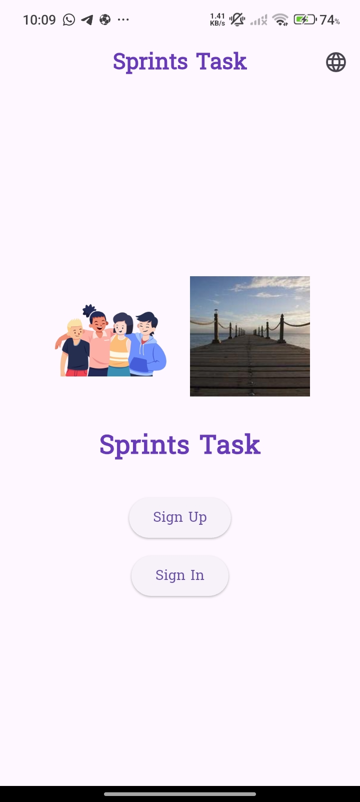
  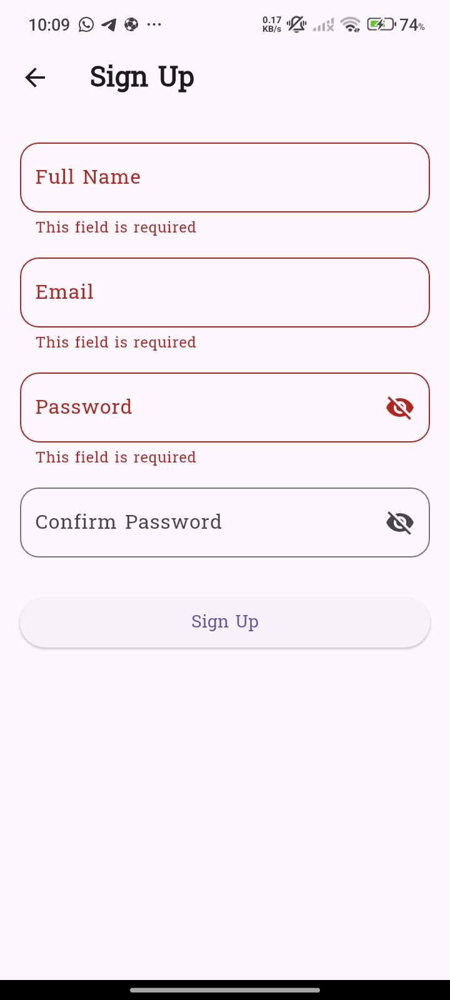
  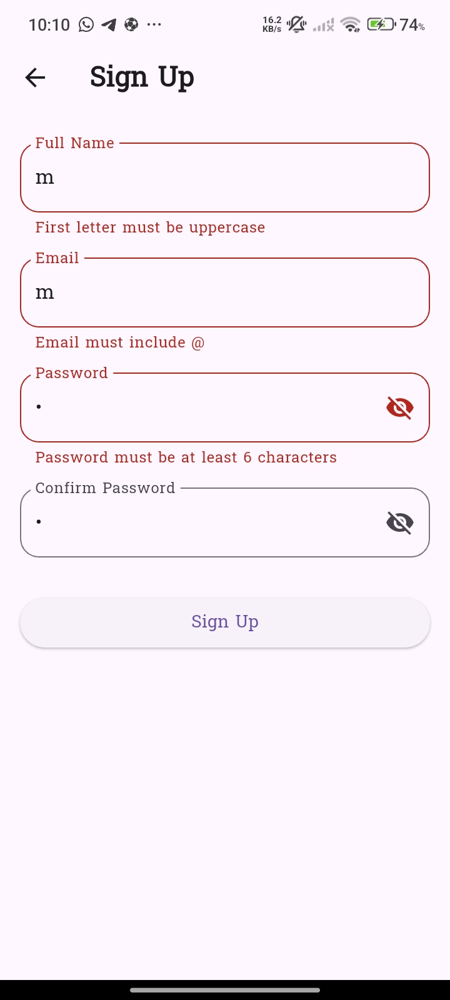
  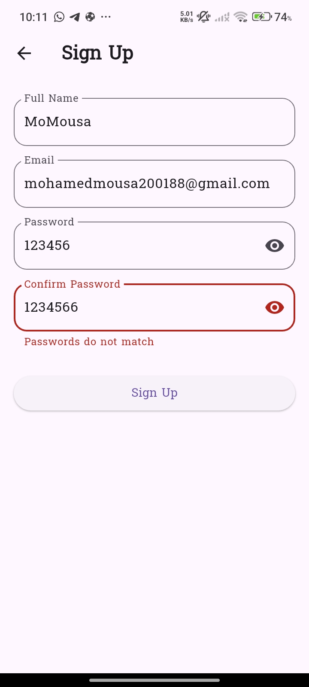
  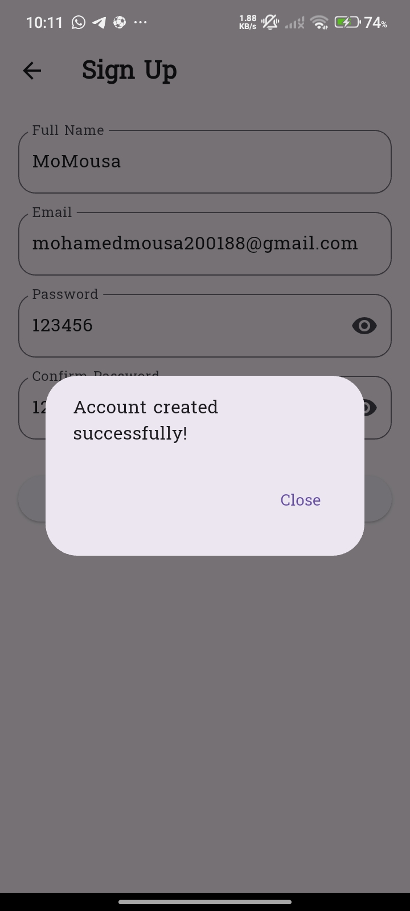
  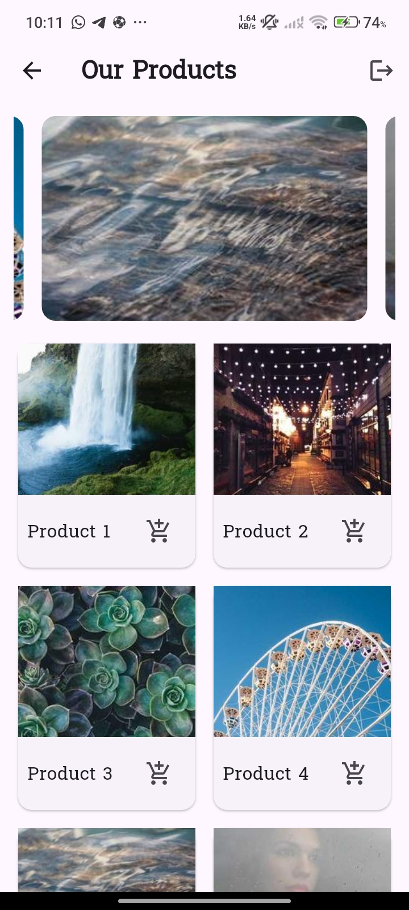
  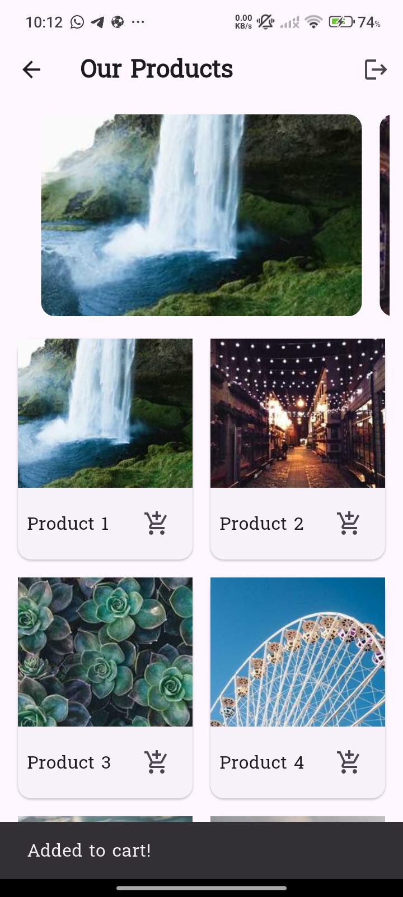
  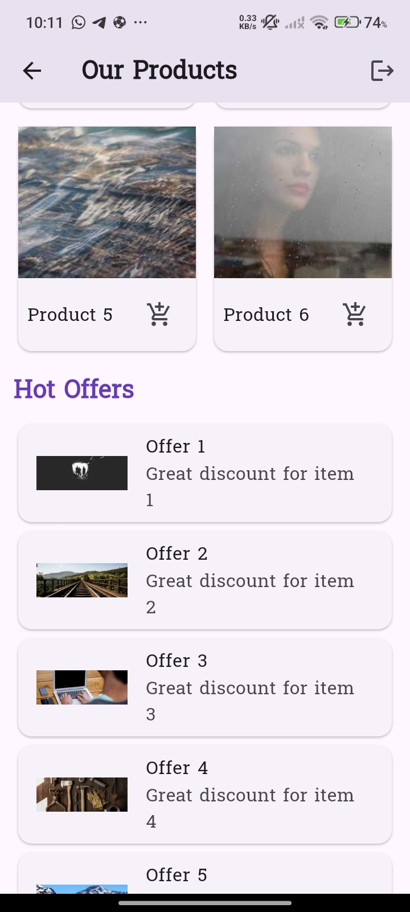
  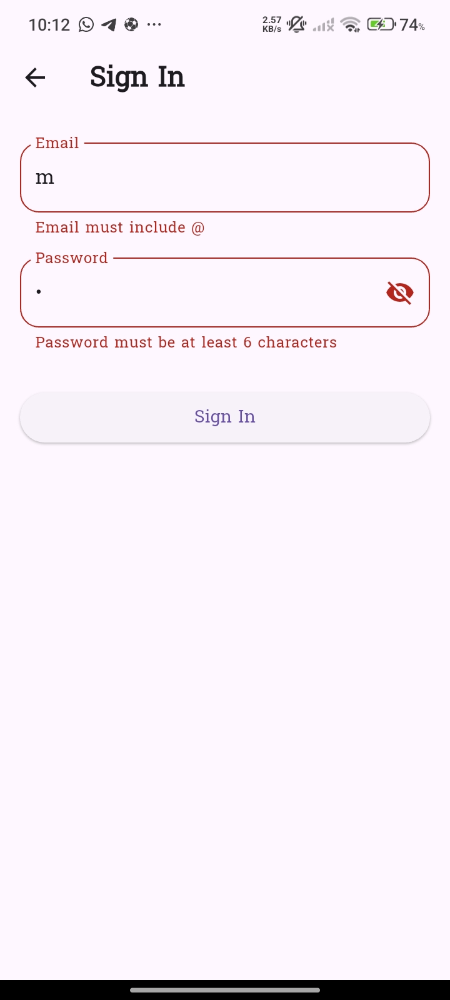
  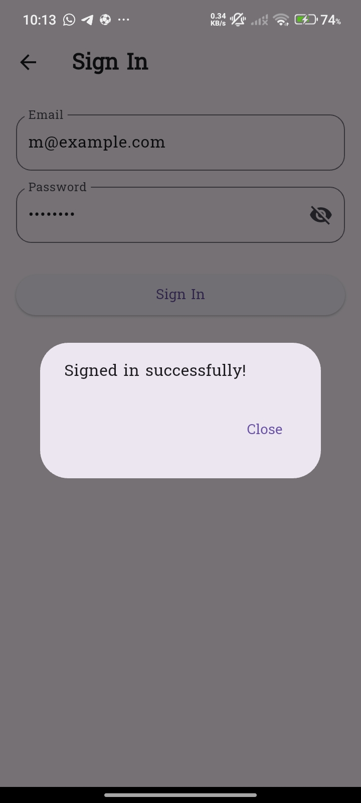

  #### In Arabic Screens
  <p float="left">
  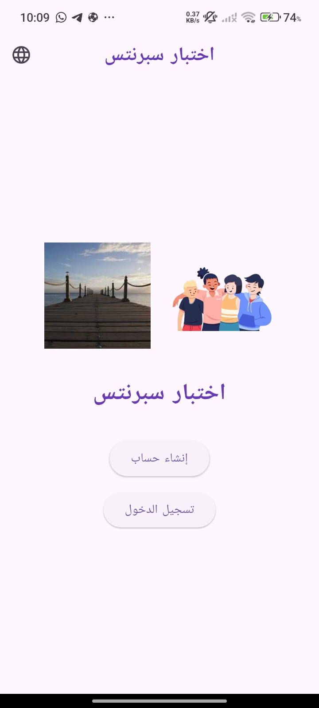
  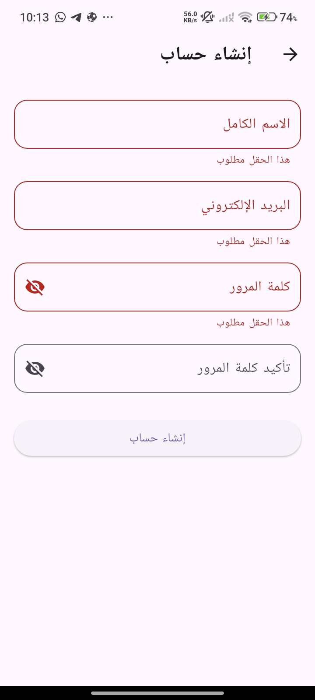
  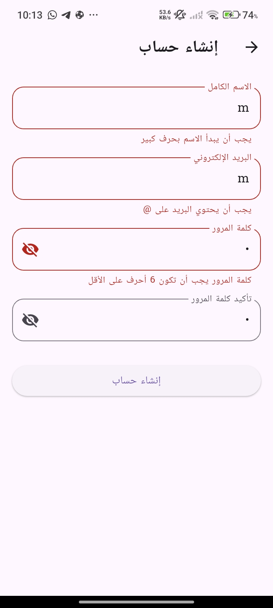
  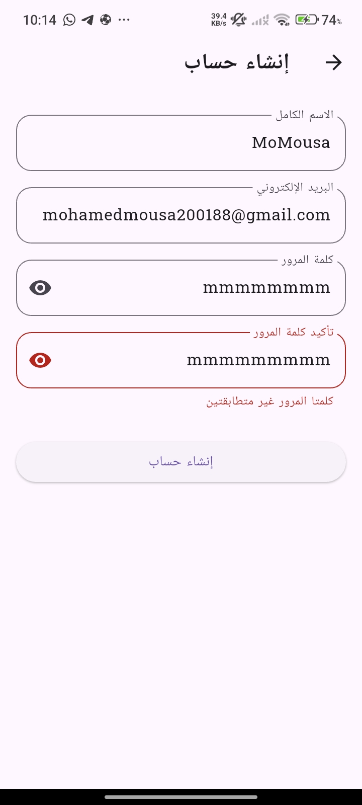
  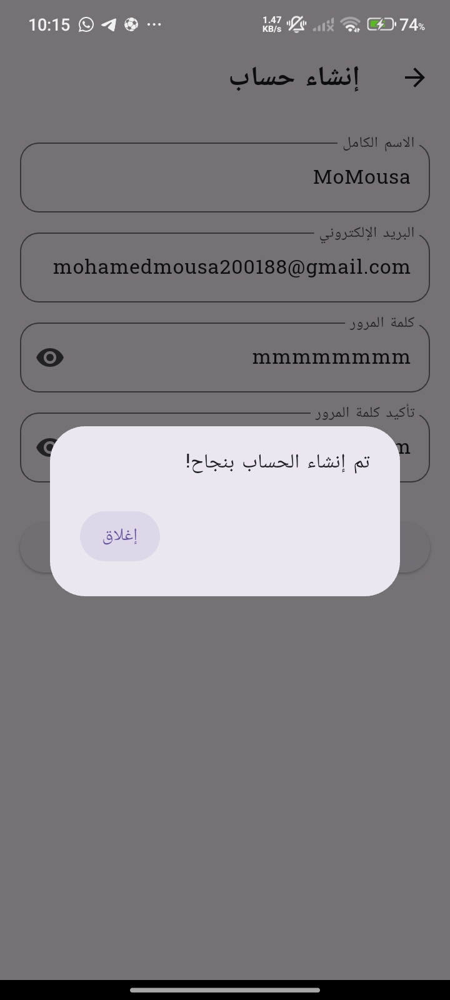
  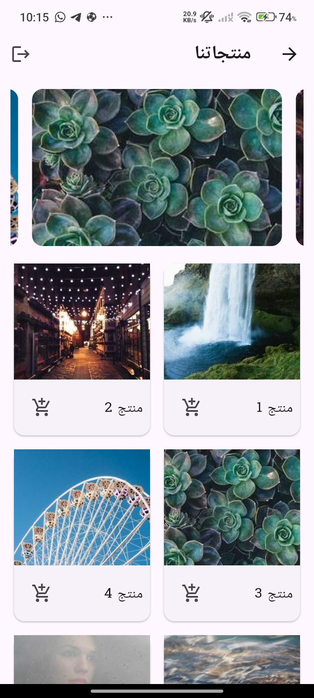
  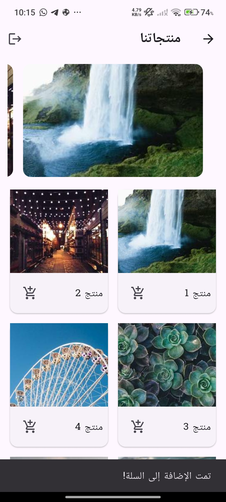
  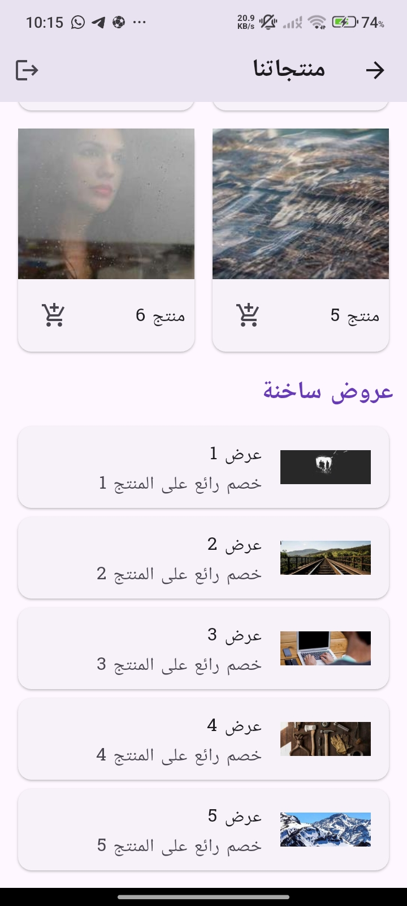

  

  
---

## 🧹 Code Quality

* Each widget/class is placed in a separate file.
* No unused or duplicated code.
* Clear naming conventions followed.
* Formatted using Flutter’s built-in formatter.

---

## 👤 Author

**Mohamed Mousa**

* [GitHub](https://github.com/MoMousa-22)
* [LinkedIn](https://www.linkedin.com/in/mohamed-mousa-b1946a24a)
* [Gmail](mailto:mohamedmousa200188@gmail.com)


